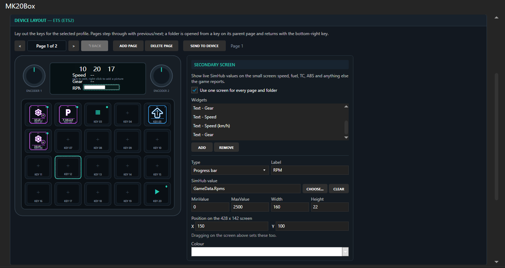
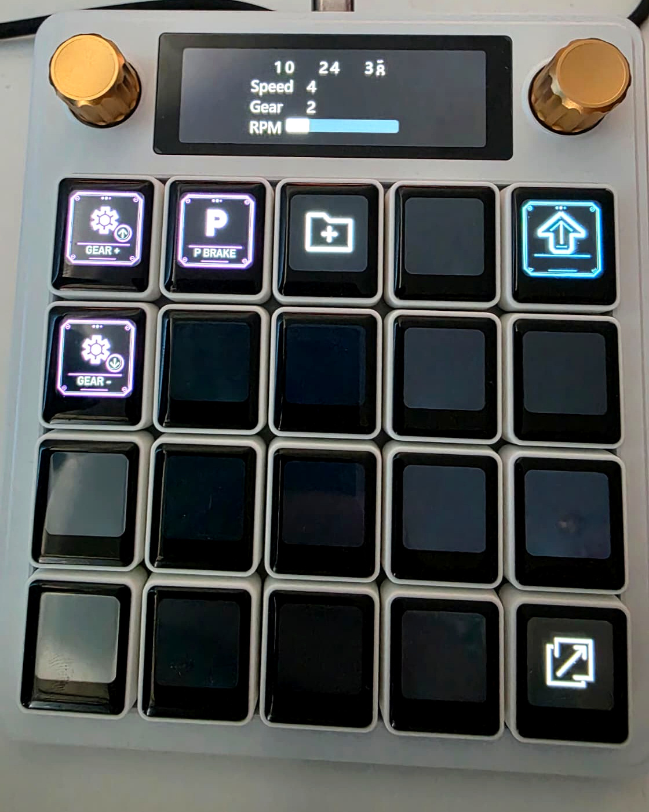

<div align="center">

# MK20Box

**Turn your Waveshare MK20 into a live sim-racing dashboard and button box.**

A SimHub plugin that puts real telemetry on the keys and the strip — speed, gear,
fuel, tyre temps — and sends real keystrokes back to the game.

[](LICENSE)
[](https://dotnet.microsoft.com/)
[](https://www.simhubdash.com/)
[](https://www.waveshare.com/)



</div>

---

## What it does

Your MK20 has 20 little LCD keys, two rotary encoders and a 428×142 display.
MK20Box makes all of it useful while you drive.

|  | |
|---|---|
| **Live telemetry** | Speed, gear, RPM, fuel, tyre temps — anything SimHub reports, on the strip |
| **Real keystrokes** | The device sends them itself, so they work even with SimHub minimised |
| **Per-game profiles** | ETS2 gets truck controls, iRacing gets pit controls, switched automatically |
| **Shareable** | Export a profile to a file — pictures included — and send it to a friend |
| **Pages & folders** | Twenty keys is never enough. Nest them |
| **530+ icons** | A sim-racing icon set is built in, or drop in your own picture or GIF |
| **Encoders** | Volume, brightness, media — or a different keystroke per direction |
| **Macros** | Type a whole pit message from one key |

## Install

1. Download the latest release and unzip it.
2. Copy the contents into your SimHub folder, usually
   `C:\Program Files (x86)\SimHub`, keeping the layout intact:

   ```
   Mk20Box.dll             <- plugin
   Mk20Box\                <- its dependencies and icons
   Languages\Mk20Box.resx  <- translations
   ```

3. Restart SimHub, open **Settings -> Plugins**, and enable **MK20Box**.
4. Plug in the MK20. It is picked up automatically.

Nothing SimHub ships is replaced, so removing those three items uninstalls it cleanly.

## Getting started

Open the **MK20Box** page in SimHub's sidebar.

The editor is a picture of your device. Click a part of it, and the panel on
the right becomes the editor for that part:

- **Click a key** — give it a picture, a label and an action.
- **Click the strip** — add widgets that show live telemetry.
- **Click an encoder** — choose what turning it does.

Press **Send to device** when you like what you see.

> **Tip:** right-click a key or the strip for picture options.

<div align="center">



<sub>The same profile on the real device</sub>

</div>

## Documentation

**[Usage guide](docs/usage.md)** — how to drive the plugin

- [Keys](docs/usage.md#keys) — icons, labels, keystrokes, macros
- [Pages and folders](docs/usage.md#pages-and-folders) — more than twenty keys
- [Secondary screen](docs/usage.md#secondary-screen) — widgets and live telemetry
- [Encoders](docs/usage.md#encoders) — the two knobs
- [Profiles](docs/usage.md#profiles) — a layout per game
- [Properties](docs/usage.md#properties-exposed-to-simhub) — what SimHub gets back
- [If something does not work](docs/usage.md#if-something-does-not-work)

**[Architecture](docs/architecture.md)** — how it is implemented

- [Project layout](docs/architecture.md#layout)
- [Two seams](docs/architecture.md#two-seams) — the device format and the host API
- [Where work happens](docs/architecture.md#where-work-happens) — device vs plugin
- [Telemetry](docs/architecture.md#telemetry) and [profiles](docs/architecture.md#profiles)
- [Device constraints](docs/architecture.md#device-constraints-worth-knowing) — hard-won facts
- [Building](docs/architecture.md#building)

**[Icon catalogue](SIM_RACING_ICONS.md)** — every bundled icon, by category

## Building

Requires the .NET SDK and a local SimHub install, whose assemblies are
referenced but never modified.

```powershell
setx SIMHUB_INSTALL_PATH "C:\Program Files (x86)\SimHub\"
git clone --recursive https://github.com/alexmuraru27/Mk20Box.git
cd Mk20Box
.\build.ps1
```

The result is staged in `dist\Mk20Box`, ready to copy. While developing,
`.\deploy.ps1` builds and installs it for you.

## Credits

Built on [MK20Control](external/MK20Control), a reverse-engineered library for
the MK20's serial protocol. MK20Box is an independent project and is not
affiliated with Waveshare or SimHub.

## Licence

[Apache 2.0](LICENSE).
